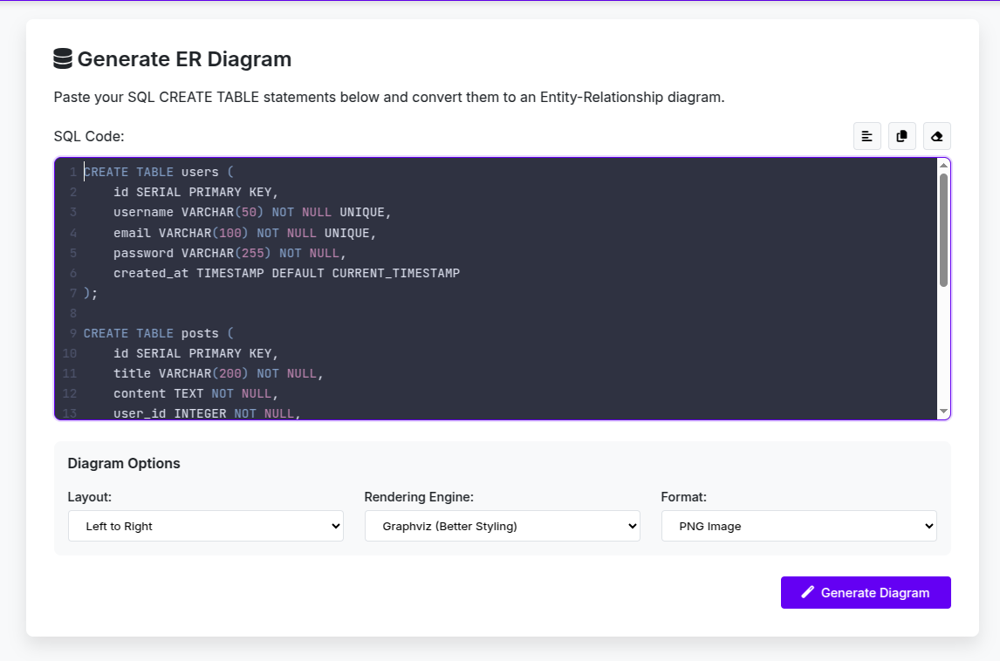
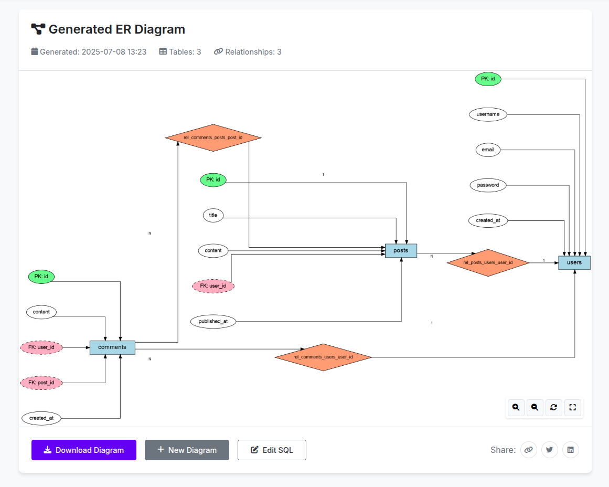

# ER-Diagram-Generator

**ER-Diagram-Generator** is a web-based tool that converts SQL DDL (Data Definition Language) statements into Entity-Relationship (ER) diagrams. It parses SQL `CREATE TABLE` statements, detects tables and their relationships, and generates visual diagrams in PNG, SVG, or PDF formats.

---

##  Features

- **Web Interface** – Paste SQL code and configure output options.
- **Automatic Parsing** – Detects tables, primary keys, foreign keys, and relationships.
- **Multiple Output Formats** – Supports PNG, SVG, and PDF.
- **Customizable Orientation** – Choose diagram orientation (e.g., Left-to-Right).
- **Downloadable Diagrams** – Export diagrams for documentation or presentations.

##  Project Structure
```
.
├── app.py
├── output/
│   └── [generated diagrams]
├── requirements.txt
├── static/
│   ├── css/
│   │   └── styles.css
│   └── js/
│       └── main.js
├── templates/
│   ├── base.html
│   ├── index.html
│   └── result.html
└── utils/
    ├── diagram.py
    ├── diagram_pydot.py
    ├── __init__.py
    ├── parser.py
    └── __pycache__/
```

## Installation

```bash
git clone https://github.com/Mahmoud-Khawaja/ER-Diagram-Generator
cd ER-Diagram-Generator
```
```bash
python3 -m venv venv
source venv/bin/activate
```

```bash
pip install -r requirements.txt
```

```bash
python app.py
```


### How to Use

1. Open [http://localhost:5000/](http://localhost:5000/) in your browser.
2. Paste your SQL `CREATE TABLE` statements in the form.
3. Choose your configuration options:
   - **Orientation** (e.g., `LR` - Left to Right)
   - **Output Format** (`PNG`, `SVG`, `PDF`)
   - **Rendering Engine** (`Graphviz` or `pydot`)
4. Click **Generate** to view and download your ER diagram.

#### Screenshots

**Step 1 – Input your SQL:**



**Step 2 – View and Download the ER Diagram:**




## Customization

- **Diagram Orientation:** `LR` (Left-to-Right), `TB` (Top-to-Bottom), etc.
- **Output Format:** `PNG`, `SVG`, `PDF`.
- **Rendering Engine:** `Graphviz` (default, more advanced) or `pydot`.

---

## Limitations

- **Many-to-many (M:N)** relationships are not fully supported.
- **SQL parser** is basic and may not handle all SQL dialects or advanced constraints.
- **Error messages** may need refinement for clarity and professionalism.
